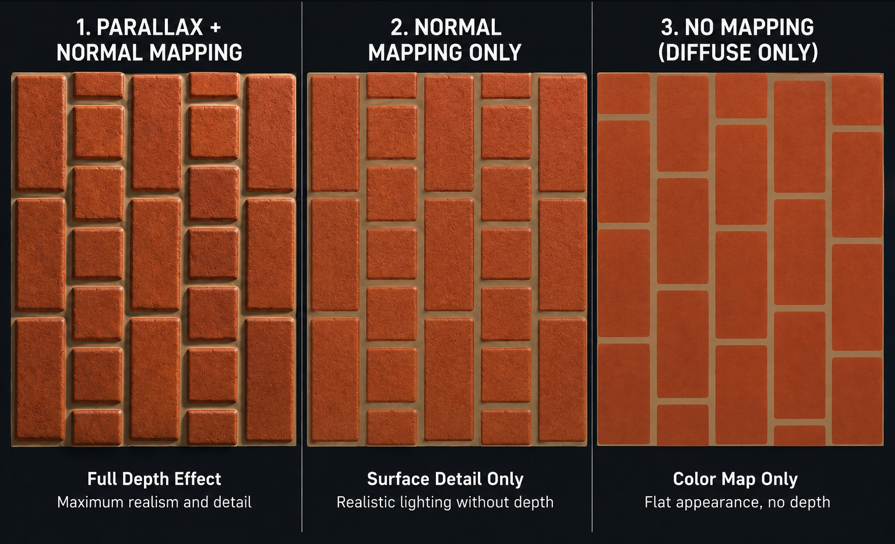
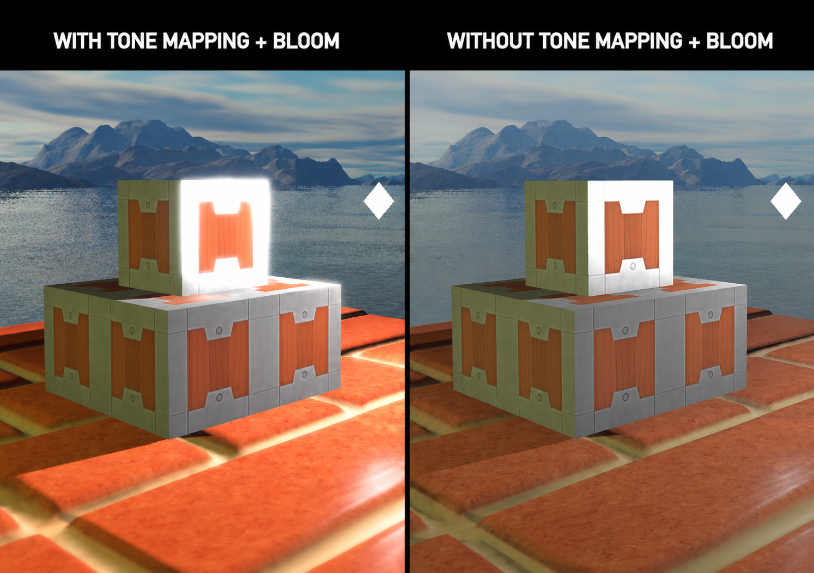

<div align="center">
  
  <h1>Pyre Graphics Engine</h1>

  <p>
    <strong>A high-performance, modular 3D rendering engine architecture built with Modern OpenGL 4.6 and C++20.</strong>
  </p>

  <p>
    <a href="#visual-showcase">Showcase</a> •
    <a href="#technical-features">Features</a> •
    <a href="#build--installation">Build</a> •
    <a href="#controls">Controls</a> •
    <a href="LICENSE">License</a>
  </p>

  
  
  
  
</div>

<br />

Pyre is a research-oriented graphics engine designed to explore advanced real-time rendering techniques. It implements a modern deferred-style architecture with a forward transparency fallback, utilizing Uniform Buffer Objects (UBOs) for efficient data transport, Screen Space Ambient Occlusion (SSAO), and Geometry Shaders for complex shadow generation.

The project features a self-contained CMake build system that automatically manages dependencies including GLFW, Assimp, and GLAD, ensuring a streamlined cross-platform compilation process.

---

## Visual Showcase

### Feature Demonstrations

**Omni-Directional Point Shadows**
*Dynamic omni-directional shadows using Geometry Shaders.*

https://github.com/user-attachments/assets/1e2e123c-aa3c-41d9-bb57-5e14d23d1234

**Cascaded Shadow Maps (CSM)**
*High-resolution directional shadows with cascade splits.*

https://github.com/user-attachments/assets/22f3f373-fad0-41c5-8a3e-8e3a32ee3bee

**Screen Space Ambient Occlusion (SSAO)**
*Physically-based ambient contact shadows utilizing randomized hemispheric kernels.*

https://github.com/user-attachments/assets/6f2fd34f-4447-4e69-a4f0-4af1c1fd7a26

**Parallax Mapping**
*Ray-marched depth displacement simulating complex surface geometry.*

https://github.com/user-attachments/assets/5386cb35-359f-4727-bbf7-e3b6d0b72452

### Screenshots

| **Environment Mapping Reflections** | **Non-Photorealistic Rendering (Toon)** |
| :---: | :---: |
|  |  |
| *Real-time reflections using skybox environment mapping.* | *Stylized rendering with discretized lighting bands and rim highlights.* |

| **Hardware Instancing (1M+ Entities)** | **Post-Processing (Inversion)** |
| :---: | :---: |
|  |  |
| *High-throughput rendering using vertex attribute divisors.* | *Framebuffer-based effects chain.* |

| **Normal & Parallax Mapping** | **HDR & Physically-Based Bloom** |
| :---: | :---: |
|  |  |
| *Ray-marched depth displacement for complex surface geometry.* | *Floating-point rendering with multi-stage Gaussian scattering.* |

---

## Technical Features

### Rendering Pipeline
* **Hybrid Deferred/Forward Architecture:**
  * **G-Buffer Generation:** Separated geometry and lighting passes storing World Position, Normals, Albedo, and Specular data for O(1) lighting complexity.
  * **Forward Transparency Fallback:** Seamlessly renders glass, foliage, and UI over the deferred composite using strict depth/blend state management.
  * **Local Light Volumes:** Point lights are rendered as physical 3D spheres (depth-tested) rather than fullscreen passes, massively optimizing scenes with dozens of active lights.
* **Advanced Shadow Mapping:**
  * **Cascaded Shadow Maps (CSM):** High-resolution directional shadows dynamically split across depth layers to eliminate perspective aliasing over long distances.
  * **Omnidirectional Shadow Mapping:** Utilizes Geometry Shaders to clone point light geometry onto Cubemap Arrays in a single pass, slashing CPU draw call overhead.
  * **Percentage-Closer Filtering (PCF):** Applied to both shadow techniques for physically softer edges.
* **Screen Space Ambient Occlusion (SSAO):** Physically-based ambient contact shadows utilizing a randomized hemispheric kernel, TBN space transformations, and an edge-aware blur pass to ground geometry in the scene.
* **Advanced Material System:** Employs **Normal Mapping** for high-fidelity surface light interaction, and **Parallax Displacement Mapping** (ray-marched depth) for simulating complex, deep surface geometry without the heavy polygon cost.
* **Hardware Instancing:** Optimized rendering path for high-density scenes (e.g., asteroid belts) capable of pushing millions of polygons at interactive framerates.

### Engine Architecture
* **Post-Processing & HDR Pipeline:** 
  * **High Dynamic Range (HDR):** Renders lighting in high-precision floating-point format before resolving to the screen using customizable tone-mapping.
  * **Physically-Based Bloom:** Multi-stage Gaussian blur applied to bright-pass extractions to simulate realistic lens scattering and glowing emissive materials.
* **Entity-Component System (ECS):** Flexible object composition using abstract `Entity` containers and modular components (`MeshComponent`, `LightComponent`, `SkyboxComponent`).
* **Modular GLSL Preprocessor:** Custom shader compilation pipeline supporting `#include` directives to modularize lighting math, UBO definitions, and utility functions across the pipeline.
* **Data-Oriented State:** Extensive use of **Uniform Buffer Objects (UBOs)** with strict `std140` memory layout for efficient global state transport (Camera, Cascades, Shadow Matrices).
* **Asset Management:** Centralized `ResourceManager` providing thread-safe loading, caching, and reference counting for textures, models, and shaders.
* **Modern C++ Toolchain:** Strictly enforced C++20 formatting pipeline powered by `clang-format` (LLVM standard) to guarantee a highly maintainable, uniform codebase structure.

---

## Prerequisites

Ensure the following tools are available in your environment:

* **C++20 Compliant Compiler** (MSVC 19.28+, GCC 10+, or Clang 10+)
* **CMake 3.16** or higher
* **Git**

*Note: Dependencies such as GLFW, Assimp, GLM, and GLAD are fetched automatically via CMake.*

---

## Build & Installation

### Option A – Visual Studio 2022 (Recommended)
1.  Clone the repository.
2.  Open Visual Studio.
3.  Select **Open a Local Folder** and target the `pyre` directory.
4.  Allow CMake to configure the project cache.
5.  Select **Pyre.exe** as the startup target and run.

### Option B – Command Line

```bash
# 1. Clone the repository
git clone [https://github.com/Open-Source-Chandigarh/pyre.git](https://github.com/Open-Source-Chandigarh/pyre.git)
cd pyre

# 2. Generate build files
mkdir build && cd build
cmake ..

# 3. Compile
cmake --build . --config Debug

### **Run the Engine**


```bash

# Windows

.\Debug\Pyre.exe


# Linux / macOS

./Pyre

```


---


## Controls


```

Key             Action

W, A, S, D       Move Camera

Mouse            Look Around

Scroll           Adjust FOV

Right Arrow      Next Scene

Left Arrow       Previous Scene

F                Toggle Wireframe

R                Reset Camera

ESC              Lock/Unlock Mouse

```


---


## 📂 Project Structure

```text
Pyre/
├── CMakeLists.txt            # Build configuration
├── deps/                     # Vendor dependencies
├── includes/                 # Public C++ headers
│   ├── application/
│   ├── core/
│   ├── helpers/
│   ├── scenes/
│   └── thirdparty/
├── resources/                # Engine assets
│   ├── config/
│   ├── gifs/
│   ├── models/               # OBJ/MTL files
│   ├── screenshots/
│   └── textures/             # Diffuse/Specular/Normal maps, Skyboxes
├── shaders/                  # GLSL programs
│   ├── common/
│   ├── deferred/             # G-Buffer and Deferred Lighting logic
│   ├── includes/             # Shared GLSL modules via preprocessor
│   ├── postprocessing/       # SSAO, Bloom, Tone-mapping
│   ├── shadows/              # Point and Directional shadow passes
│   └── testing/
└── src/                      # Engine source code
    ├── application/          # App state management
    ├── core/                 # Core engine internals
    │   ├── postprocessing/   # Post-Processing Pipeline
    │   ├── rendering/        # Renderer, Framebuffer, Mesh, Materials
    │   │   └── geometry/     # Geometry factory (Cubes, Spheres, Planes)
    │   ├── InputManager.cpp  
    │   ├── LightManager.cpp  
    │   ├── ResourceManager.cpp 
    │   ├── UniformBuffer.cpp 
    │   └── Window.cpp        
    ├── helpers/              # Serializers, Shader compiler, Input Mappers
    ├── scenes/               # Specific scene implementations (Space, Factory, Toon, etc.)
    └── main.cpp              # Entry point & primary game loop
```

---

## Contributing


Want to implement **Shadow Mapping**, **Normal Mapping**, or optimizations?


```bash

git checkout -b feature/AmazingFeature

# implement your changes

git commit -m "Add AmazingFeature"

git push origin feature/AmazingFeature

```


Then open a **Pull Request**.


If you’d like to contribute, please read the [CONTRIBUTING.md](https://github.com/Open-Source-Chandigarh/pyre?tab=contributing-ov-file).


---


## Credits


* **Joey de Vries** – Creator of LearnOpenGL

* **GLFW, GLAD, GLM, Assimp, stb_image** – The tech stack powering Pyre


---


## 📄 License


Licensed under the **MIT License**. See the `LICENSE` file for details.
