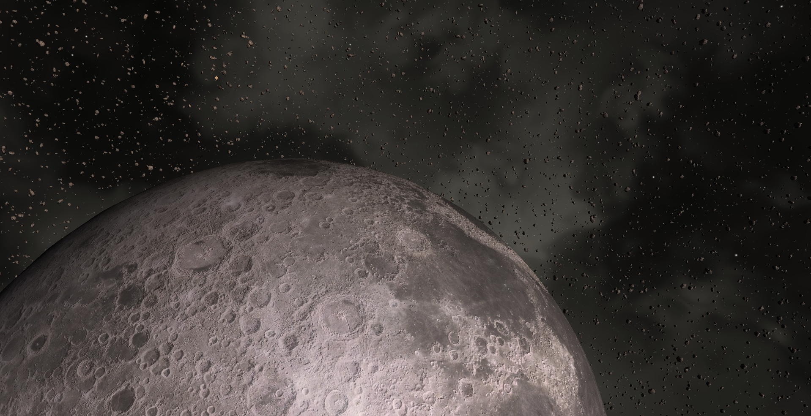
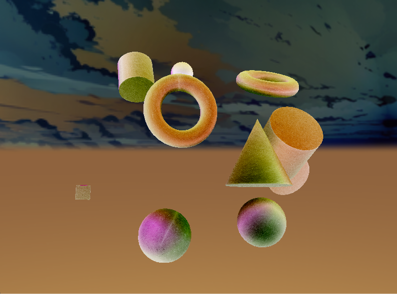

# Pyre – Graphics Engine

**Pyre** is a modular, educational **3D graphics engine** built from scratch using **Modern OpenGL** and **C++20**. Inspired by the brilliant work behind **LearnOpenGL**, Pyre explores advanced real-time rendering concepts, including **Instancing**, **Geometry Shaders**, **Post‑Processing**, and **Toon Shading**.

It features a **custom CMake build system** that automatically fetches and configures dependencies like **GLFW** and **Assimp**, making the engine cross‑platform and effortless to build.

<div align="center">
  
</div>

---

## 📸 Visual Showcase

See Pyre's rendering features in action.

| **Standard Blinn-Phong Lighting** | **Cel-Shading (Toon)** |
| :---: | :---: |
|  |  |
| *Classic lighting model with multiple light sources.* | *Stylized rendering with rim lighting and distinct bands.* |

| **Instanced Rendering (1M+ Meshes) at 144+ fps** | **Post-Processing (Inversion)** |
| :---: | :---: |
|  |  |
| *Instanced Rendering using vertex atrrib model matrices.* | *Framebuffer-based inversion effect with ping pong post processing.* |

---

## ✨ Features

### 🎨 Rendering Pipeline

* **Modular Shaders**: Custom preprocessor enabling `#include` directives inside GLSL.
* **Lighting**: **Blinn‑Phong** lighting supporting **Directional**, **Point**, and **Spotlights**, powered by **Uniform Buffer Objects (UBOs)**.
* **Instanced Rendering**: Efficient rendering for thousands of identical meshes (e.g., asteroid fields, particle clouds).
* **Geometry Shaders**: Used for **normal visualization** and dramatic **mesh explosion** effects.
* **Post‑Processing Stack**: Framebuffer‑based pipeline supporting **Inversion**, **Grayscale**, **Sharpening**, and **Outline detection**.
* **Toon Shading**: Cel‑shaded rendering with stylized **rim‑lighting**.

### 🛠 Core Architecture

* **Entity‑Component Layout**: `Entity`, `MeshRenderer`, `ModelRenderer` for clean object representation.
* **Centralized Asset Manager**: Texture caching, model loading, and safe path handling.
* **Scene System**: Hot‑swappable environments (`Factory`, `Backpack`, `Toon`, `Test`) controlled via a global application state.
* **Debug Utilities**: Wireframe mode, shader hot‑reload, and visual debugging tools.

---

## 💻 Prerequisites

Before building Pyre, ensure these tools are installed:

* **C++20 Compiler**
  * Windows → Visual Studio 2022 (MSVC)
  * Linux → GCC 10+ or Clang 10+
  * macOS → Xcode Command Line Tools
* **CMake ≥ 3.16**
* **Git**

> You do **not** need to install GLFW, Assimp, GLM, or GLAD manually — the CMake script does everything.

---

## 🔨 Build & Installation


### **Option A – Visual Studio 2022 (Recommended)**


1. Clone the repository.

2. Open **Visual Studio**.

3. Select **Open a Local Folder** and choose `pyre`.

4. Let VS detect and configure `CMakeLists.txt`.

5. Select **Pyre.exe** as the startup target and press **F5** to run.


### **Option B – Command Line (Windows / Linux / macOS)**


```bash

# Clone the repository

git clone https://github.com/Open-Source-Chandigarh/pyre.git

cd pyre


# Create a build directory

mkdir build && cd build


# Configure (downloads third‑party dependencies)

cmake ..


# Build

cmake --build . --config Debug

```


### **Run the Engine**


```bash

# Windows

.\/Debug\/Pyre.exe


# Linux / macOS

./Pyre

```


---


## 🎮 Controls


```

Key             Action

W, A, S, D       Move Camera

Mouse            Look Around

Scroll           Adjust FOV

Right Arrow      Next Scene

Left Arrow       Previous Scene

F                Toggle Wireframe

R                Reset Camera

ESC              Lock/Unlock Mouse

```


---


## 📂 Project Structure


```

Pyre/

├── CMakeLists.txt            # Build configuration

├── .gitignore                # Ignore build artifacts

├── src/                      # Engine source

│   ├── main.cpp              # Entry point & game loop

│   ├── core/                 # Engine internals

│   │   ├── rendering/        # Renderer, Mesh, Model, FBO

│   │   │   └── geometry/     # Procedural shapes (Cube, Sphere, Torus)

│   │   ├── Window.cpp        # GLFW window wrapper

│   │   └── InputManager.cpp  # Input processing

│   └── scenes/               # Example scenes

├── includes/                 # Public headers

│   ├── core/                 # Engine interfaces

│   ├── scenes/               # Scene declarations

│   └── thirdparty/           # GLAD, stb_image, etc.

├── shaders/                  # GLSL programs

│   ├── modularVertex.vs      # Vertex uber-shader

│   ├── modularFragment.fs    # Lighting uber-shader

│   ├── includes/             # Shared GLSL modules

│   └── postprocessing/       # Screen effects

└── resources/                # Assets

    ├── models/               # OBJ files

    └── textures/             # Diffuse/specular maps, skyboxes

```


---


## 🤝 Contributing


Want to implement **Shadow Mapping**, **Normal Mapping**, or optimizations?


```bash

git checkout -b feature/AmazingFeature

# implement your changes

git commit -m "Add AmazingFeature"

git push origin feature/AmazingFeature

```


Then open a **Pull Request**.


If you’d like to contribute, please read the [CONTRIBUTING.md](https://github.com/Open-Source-Chandigarh/pyre?tab=contributing-ov-file).


---


## 🙌 Credits


* **Joey de Vries** – Creator of LearnOpenGL

* **GLFW, GLAD, GLM, Assimp, stb_image** – The tech stack powering Pyre


---


## 📄 License


Licensed under the **MIT License**. See the `LICENSE` file for details.
